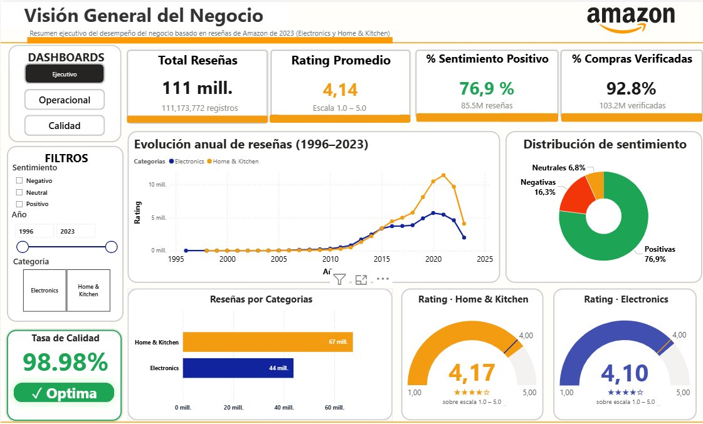
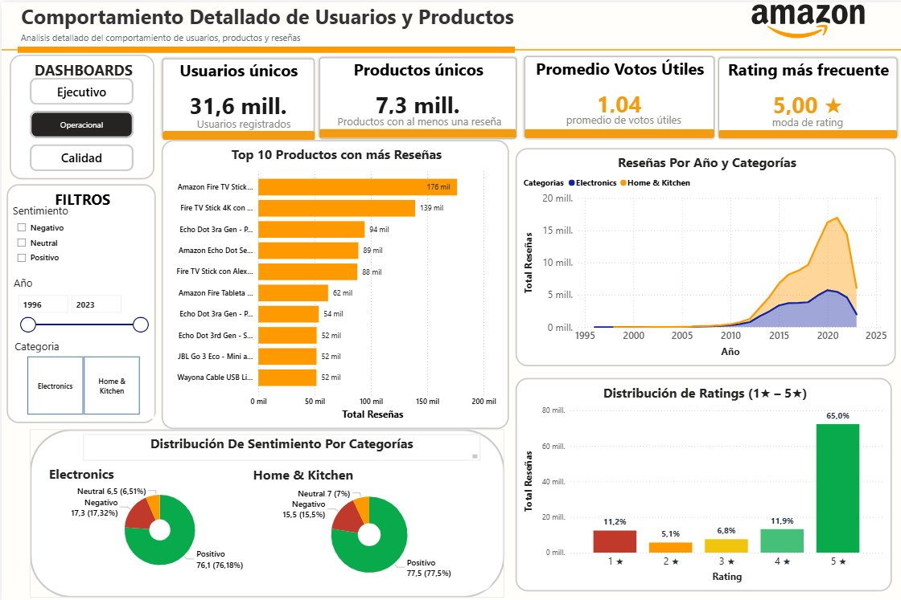
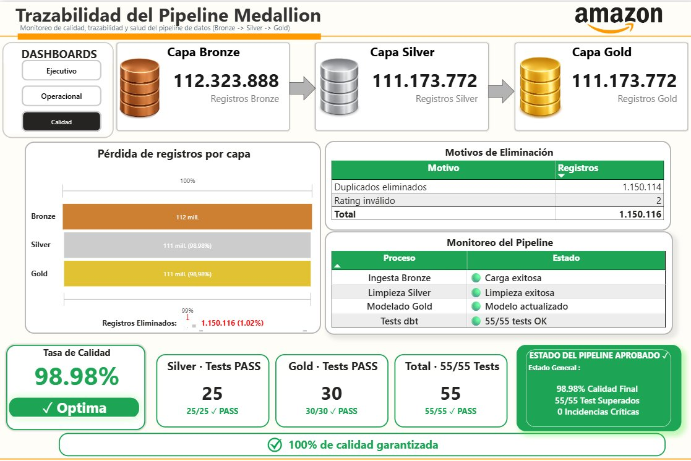

# 🛒 Amazon BI Pipeline — Programación Avanzada 2026-I

> **De la Opinión a la Decisión: 111 Millones de Reseñas Amazon Convertidas en Inteligencia de Negocio**

Universidad Popular del Cesar · Ing. Amilkar Sierra Romano · Mayo 2026

---

## 👥 Equipo

| Integrante                   | Rol                | Responsabilidad                    |
| ---------------------------- | ------------------ | ---------------------------------- |
| **Jaider Vanegas** _(Líder)_ | Data Engineer      | Ingesta, Kafka, capa Bronze        |
| **Juan Camilo San Martín**   | Analytics Engineer | Capa Silver, dbt Silver            |
| **Juan de Dios González**    | BI Developer       | Capa Gold, Star Schema, Dashboards |

---

## 📋 Descripción

Pipeline de Business Intelligence end-to-end sobre **111.3 millones de reseñas reales de Amazon (1996–2023)**, construido sobre la **Arquitectura Medallion** (Bronze → Silver → Gold) en Databricks. Los datos fluyen desde Apache Kafka hasta dashboards interactivos en Power BI, pasando por transformaciones incrementales con Spark Structured Streaming, Delta Lake y dbt.

---

## 🗂️ Estructura del Repositorio

```
amazon-bi-pipeline/
│
├── ingestion/
│   └── kafka/
│       ├── producer.py          # Productor Kafka — 1,027,000 eventos reales
│       ├── consumer.py          # Consumidor JSONL — 103 archivos, 415 MB
│       ├── docker-compose.yml   # Kafka + ZooKeeper + Kafka UI
│       ├── Subir_Databricks.py  # Carga al Volume landing de Databricks
│       └── requirements.txt
│
├── processing/
│   └── notebooks/
│       ├── 01_bronze.py         # Auto Loader + Spark Structured Streaming → Bronze
│       ├── 02_silver.py         # Limpieza PySpark + Delta Silver
│       └── utils.py
│
├── transformation/
│   └── dbt_project/
│       ├── dbt_silver/
│       │   └── models/silver/silver_reviews.sql
│       └── dbt_gold/
│           └── models/gold/     # 5 modelos Gold + schema.yml
│
├── dashboards/                  # Ejecutivo / Operacional / Calidad
├── docs/
├── README.md
└── .gitignore
```

---

## 🏗️ Arquitectura Medallion

```
HuggingFace Dataset
        ↓
   Kafka (Docker)
   topic: amazon-reviews
   6 particiones · 1,027,000 eventos
        ↓
┌─────────────────────────────────────────────────────┐
│                   DATABRICKS                        │
│                                                     │
│  BRONZE ──────────────────────────────────────────  │
│  Auto Loader + Spark Structured Streaming           │
│  112,323,888 registros crudos                       │
│  amazon_bi.bronze.reviews_raw                       │
│                    ↓                                │
│  SILVER ──────────────────────────────────────────  │
│  PySpark + dbt Core                                 │
│  111,173,772 registros limpios (98.98% calidad)     │
│  amazon_bi.silver.reviews_clean                     │
│  25 tests dbt PASS                                  │
│                    ↓                                │
│  GOLD ────────────────────────────────────────────  │
│  dbt Core · Star Schema · Unity Catalog             │
│  5 tablas · 30 tests dbt PASS                       │
│  amazon_bi.gold.*                                   │
│                    ↓                                │
│  VISTAS ANALÍTICAS (Power BI)                       │
│  14 vistas sobre Gold                               │
└─────────────────────────────────────────────────────┘
        ↓
   Power BI (DirectQuery)
   SQL Warehouse: dbc-31907689-2af4.cloud.databricks.com
   3 Dashboards: Ejecutivo · Operacional · Calidad
```

---

## 📊 Dataset

**Amazon Reviews 2023** — McAuley Lab, UCSD  
🔗 [huggingface.co/datasets/McAuley-Lab/Amazon-Reviews-2023](https://huggingface.co/datasets/McAuley-Lab/Amazon-Reviews-2023)

| Categoría      | Usuarios  | Registros   | Volumen      |
| -------------- | --------- | ----------- | ------------ |
| Electronics    | 18.3 M    | 43.9 M      | ~21.1 GB     |
| Home & Kitchen | 23.2 M    | 67.4 M      | ~29.3 GB     |
| **TOTAL**      | **~41 M** | **111.3 M** | **~50.4 GB** |

### Esquema de eventos Kafka (JSON)

```json
{
  "event_id": "uuid-v4",
  "user_id": "string",
  "product_id": "string (ASIN)",
  "event_type": "review | purchase | view",
  "rating": 1.0,
  "category": "Electronics | Home_and_Kitchen",
  "timestamp": 1234567890000,
  "verified_purchase": true,
  "helpful_vote": 3
}
```

---

## 🥉 Capa Bronze

**Responsable:** Jaider Vanegas · rama `feature/ingestion`

- **Fuente:** 103 archivos JSONL (415 MB) en `/Volumes/amazon_bi/bronze/landing/`
- **Ingesta:** Auto Loader con checkpoint incremental (`cloudFiles`)
- **Salida:** `amazon_bi.bronze.reviews_raw` — **112,323,888 registros**
- **Particionado:** por `category`
- **Metadatos de auditoría:** `_bronze_load_ts`, `_source`, `_kafka_partition`, `_kafka_offset`

### Simulación Kafka

```bash
# Levantar infraestructura
cd ingestion/kafka
docker-compose up -d

# Ejecutar productor (1,027,000 eventos reales)
python producer.py

# Ejecutar consumidor (genera 103 archivos JSONL)
python consumer.py

# Cargar a Databricks Volume
python Subir_Databricks.py
```

---

## 🥈 Capa Silver

**Responsable:** Juan Camilo San Martín · rama `feature/processing` · commit `510a78d`

| Métrica                    | Valor            |
| -------------------------- | ---------------- |
| Registros Bronze (entrada) | 112,323,888      |
| Registros Silver (salida)  | 111,173,772      |
| Registros eliminados       | 1,150,116        |
| Tasa de calidad            | **98.98%**       |
| Tests dbt                  | **25 / 25 PASS** |

### Transformaciones aplicadas

| Transformación                  | Detalle                                                                                                 |
| ------------------------------- | ------------------------------------------------------------------------------------------------------- |
| Filtros de nulos                | Elimina registros con `user_id`, `rating` o `product_id` nulos                                          |
| Rango de rating                 | Rating debe estar entre 1.0 y 5.0                                                                       |
| Resolución `product_id`         | `coalesce(product_id, asin)`                                                                            |
| Deduplicación                   | `dropDuplicates` por `(user_id, product_id, timestamp)`                                                 |
| Casteo de tipos                 | `rating` → FLOAT, `helpful_vote` → INTEGER, `verified_purchase` → BOOLEAN                               |
| Estandarización de fechas       | `from_unixtime(timestamp / 1000)` + columnas `review_year`, `review_month`, `review_day`, `day_of_week` |
| Columna `sentiment`             | `positive` (≥ 4.0) · `neutral` (= 3.0) · `negative` (≤ 2.0)                                             |
| Enriquecimiento `product_stats` | CTE dbt: `avg_product_rating` y `total_reviews_product` por producto                                    |
| Limpieza de texto               | `trim(category)`                                                                                        |

---

## 🥇 Capa Gold — Star Schema

**Responsable:** Juan de Dios González · rama `feature/transformation` · commit `3fc7ff6`

```
                    gold_dim_fecha
                          │
gold_dim_usuario ── gold_fact_reviews ── gold_dim_producto
                          │
                   gold_dim_categoria
```

| Tabla                | Registros        | Descripción                                                |
| -------------------- | ---------------- | ---------------------------------------------------------- |
| `gold_fact_reviews`  | **111,173,772**  | Tabla de hechos central, particionada por `category`       |
| `gold_dim_producto`  | **7,271,203**    | Productos únicos con métricas de rating y votos            |
| `gold_dim_usuario`   | **31,587,013**   | Usuarios con total de reseñas y rating promedio            |
| `gold_dim_fecha`     | **8,883**        | Fechas con año, mes, día, trimestre y flag fin de semana   |
| `gold_dim_categoria` | **2**            | Electronics y Home_and_Kitchen con métricas de sentimiento |
| **Tests dbt**        | **30 / 30 PASS** | not_null (21), unique (4), accepted_values (5)             |

### Vistas analíticas para Power BI

| Vista                       | Descripción                                            | Dashboard   |
| --------------------------- | ------------------------------------------------------ | ----------- |
| `vw_evolucion_anual`        | Evolución anual de reseñas por categoría y sentimiento | Ejecutivo   |
| `vw_categorias`             | Dimensión de categorías (slicer)                       | Ejecutivo   |
| `vw_anios`                  | Dimensión de años (slicer)                             | Ejecutivo   |
| `vw_sentimiento`            | Distribución global de sentimiento                     | Ejecutivo   |
| `vw_compras_verificadas`    | KPI global de compras verificadas                      | Ejecutivo   |
| `gold_dim_categoria`        | Ratings promedio por categoría (gauges)                | Ejecutivo   |
| `vw_kpis_operacional`       | KPIs operacionales globales                            | Operacional |
| `top10_productos_titulos`   | Top 10 productos con más reseñas                       | Operacional |
| `vw_sentimiento_categoria`  | Sentimiento desagregado por categoría                  | Operacional |
| `vw_distribucion_ratings`   | Distribución de ratings 1★–5★                          | Operacional |
| `vw_calidad_pipeline`       | Registros por capa Bronze/Silver/Gold                  | Calidad     |
| `vw_calidad_anomalias`      | Motivos de eliminación en Silver                       | Calidad     |
| `vw_calidad_salud_pipeline` | Estado de salud del pipeline                           | Calidad     |
| `vw_calidad_tests`          | Resultados de los 55 tests dbt                         | Calidad     |

---

## 📈 Dashboards Power BI

Conexión via **DirectQuery** al SQL Warehouse de Databricks  
`dbc-31907689-2af4.cloud.databricks.com · /sql/1.0/warehouses/ae2fee5657b50a62`

### Dashboard Ejecutivo

Audiencia: Docente / Dirección



- **KPIs:** Total reseñas, Rating promedio, % Sentimiento positivo, % Compras verificadas
- **Gráficos:** Evolución anual (1996–2023), Distribución de sentimiento (donut), Reseñas por categoría
- **Gauges:** Rating específico por categoría (Home & Kitchen: 4.17 · Electronics: 4.10)
- **Filtros:** Sentimiento, Año, Categoría

### Dashboard Operacional

Audiencia: Analistas de datos



- **KPIs:** Usuarios únicos (31.6M), Productos únicos (7.3M), Votos útiles promedio, Rating más frecuente
- **Gráficos:** Top 10 productos con más reseñas, Reseñas por año y categoría, Distribución de ratings, Sentimiento por categoría
- **Filtros:** Sentimiento, Año, Categoría

### Dashboard Calidad

Audiencia: Ingeniería de datos



- **Trazabilidad:** Bronze (112.3M) → Silver (111.1M) → Gold (111.1M)
- **Motivos de eliminación:** Duplicados (1,150,114), Rating inválido (2)
- **Tests dbt:** Silver 25/25 PASS · Gold 30/30 PASS · **Total 55/55 PASS**
- **Estado del pipeline:** ✅ Ingesta Bronze · ✅ Limpieza Silver · ✅ Modelo Gold · ✅ Tests dbt

---

## 🌿 Estrategia de Ramas

| Rama                     | Responsable  | Estado                                                    |
| ------------------------ | ------------ | --------------------------------------------------------- |
| `main`                   | Todos        | Pipeline completo Bronze + Silver + Gold — **COMPLETADO** |
| `dev`                    | Todos        | Integración de features — **COMPLETADO**                  |
| `feature/ingestion`      | Jaider       | Kafka, Auto Loader, Bronze — **COMPLETADO**               |
| `feature/processing`     | Juan Camilo  | Silver, dbt Silver, 25 tests — **COMPLETADO**             |
| `feature/transformation` | Juan de Dios | Gold, Star Schema, 30 tests, Dashboards — **COMPLETADO**  |

---

## ✅ Cumplimiento del Enunciado

| Requisito                                     | Estado                                                                        |
| --------------------------------------------- | ----------------------------------------------------------------------------- |
| Kafka como sistema de mensajería              | ✅ `producer.py` → 1,027,000 eventos · topic `amazon-reviews` · 6 particiones |
| Consumer que genera archivos                  | ✅ `consumer.py` → 103 archivos JSONL (415 MB)                                |
| Auto Loader para ingesta incremental          | ✅ `01_bronze.py` con `cloudFiles` sobre Volume landing                       |
| Spark Structured Streaming → Delta Lake       | ✅ 112,323,888 registros en `amazon_bi.bronze.reviews_raw`                    |
| Delta Live Tables (DLT)                       | ✅ Configurado en notebook Bronze                                             |
| dbt Core con dbt-databricks                   | ✅ Dos proyectos: `dbt_silver` y `dbt_gold`, `dbt debug` PASS                 |
| Modelos dbt Silver                            | ✅ `silver_reviews.sql` con CTE `base` + `product_stats`                      |
| Tests dbt (not_null, unique, accepted_values) | ✅ 25 PASS Silver + 30 PASS Gold = **55/55 PASS**                             |
| schema.yml con linaje automático              | ✅ Documentado con Exposures para los 3 dashboards                            |
| Star Schema en Gold                           | ✅ `gold_fact_reviews` + 4 dimensiones en `amazon_bi.gold`                    |
| Unity Catalog                                 | ✅ Catálogo `amazon_bi` con esquemas `bronze`, `silver`, `gold`               |
| dbt Exposures                                 | ✅ `dashboard_ejecutivo`, `dashboard_operacional`, `dashboard_calidad`        |
| 3 dashboards en Power BI                      | ✅ Ejecutivo · Operacional · Calidad — conectados via DirectQuery             |
| Repositorio Git organizado                    | ✅ 5 ramas · estructura clara · commits descriptivos                          |

---

## 🔧 Stack Tecnológico

| Tecnología                 | Versión / Detalle         | Uso                                    |
| -------------------------- | ------------------------- | -------------------------------------- |
| Apache Kafka               | Docker (Confluent)        | Simulación de eventos en tiempo real   |
| Spark Structured Streaming | Databricks Runtime        | Ingesta Bronze con Auto Loader         |
| Delta Lake                 | Unity Catalog             | Almacenamiento en capas Medallion      |
| dbt Core                   | dbt-databricks            | Transformaciones Silver y Gold         |
| Power BI                   | DirectQuery               | Dashboards conectados al SQL Warehouse |
| Databricks                 | Free Edition · Serverless | Plataforma principal                   |
| Python                     | 3.x                       | Producer, Consumer, notebooks          |
| Git / GitHub               | —                         | Control de versiones                   |

---

## 🔑 Notas técnicas importantes

- **Unity Catalog obligatorio:** Todas las rutas usan `/Volumes/...` — DBFS está deshabilitado en este workspace
- **Compute Serverless:** `/tmp` como almacenamiento intermedio; no usar `/local_disk0`
- **SQL Warehouse:** HTTP path `/sql/1.0/warehouses/ae2fee5657b50a62`
- **Nombres de categoría en Gold:** `Home_and_Kitchen` (con guiones bajos) y `Electronics`

---

## 📅 Bitácora de Decisiones Técnicas

| Fecha     | Decisión                                        | Justificación                                                                |
| --------- | ----------------------------------------------- | ---------------------------------------------------------------------------- |
| Mayo 2026 | Dominio E-Commerce Amazon Reviews               | 111M registros reales, dominio en la lista del enunciado, KPIs claros        |
| Mayo 2026 | Dataset: Electronics + Home & Kitchen           | 111M registros de libre acceso desde HuggingFace                             |
| Mayo 2026 | Kafka en Docker local                           | Confluent Cloud requiere tarjeta de crédito; Docker es opción válida         |
| Mayo 2026 | Databricks Free Edition + Unity Catalog         | Catálogo `amazon_bi` con esquemas bronze, silver y gold                      |
| Mayo 2026 | Cambio de dominio: Music Streaming → E-Commerce | No existe dataset real de música con +100M registros públicamente disponible |
| Mayo 2026 | IDE: Antigravity en Windows                     | Entorno del equipo, compatible con Python, dbt y Git                         |
| Mayo 2026 | Bronze completado: 112,323,888 registros        | Auto Loader + Structured Streaming, particionado por category                |
| Mayo 2026 | Silver completada: 98.98% calidad               | Deduplicación, casteos, sentiment, 25 tests PASS · commit `510a78d`          |
| Mayo 2026 | Gold completada: Star Schema 5 tablas           | 30 tests PASS, pipeline completo mergeado a main · commit `3fc7ff6`          |
| Mayo 2026 | Power BI: vistas Gold via DirectQuery           | 14 vistas analíticas, modelo de relaciones limpio, 3 dashboards funcionales  |

---

_Universidad Popular del Cesar — Proyecto Final Programación Avanzada 2026-I_
